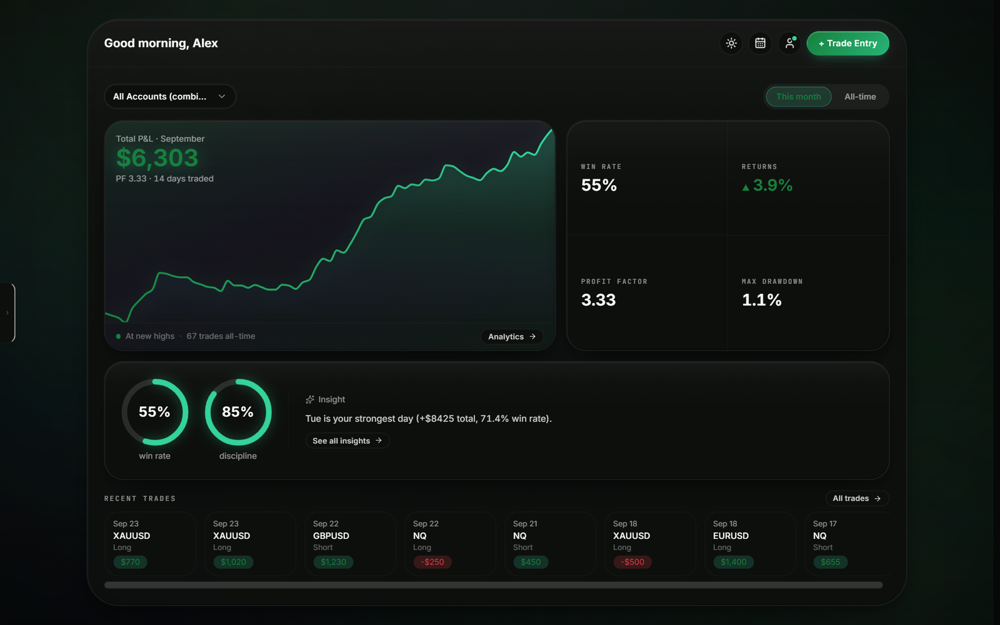
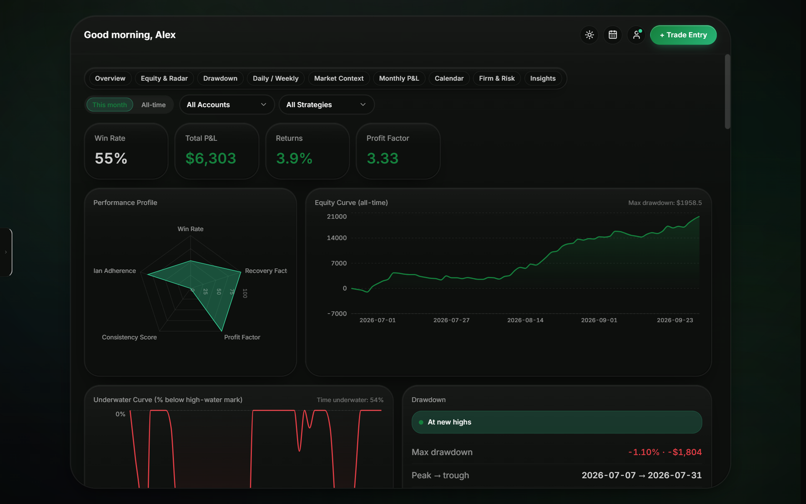
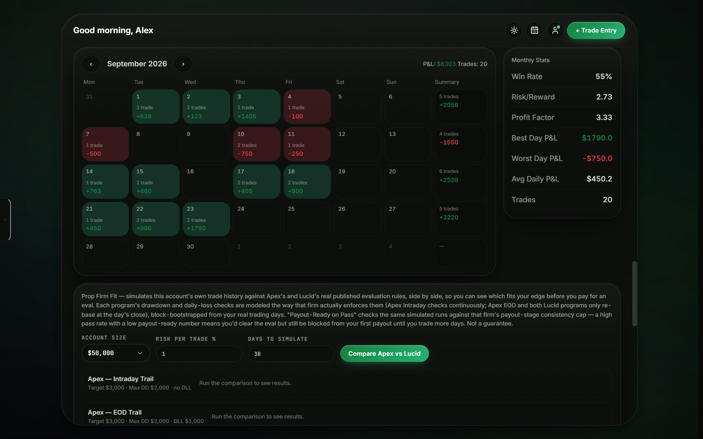
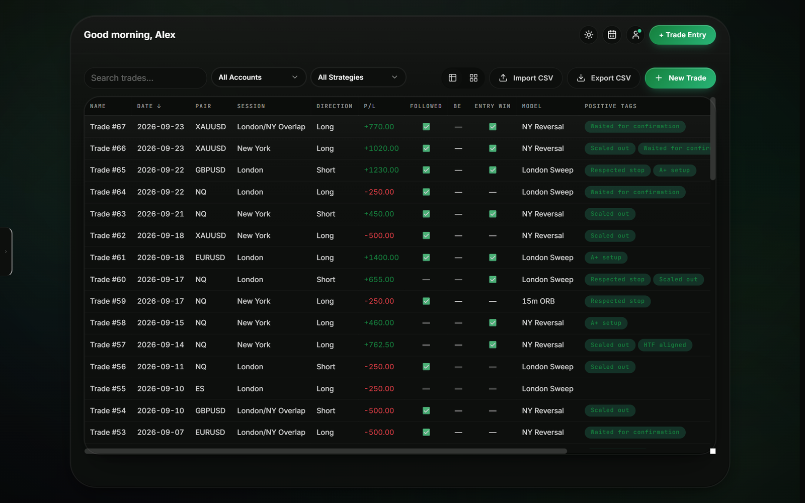
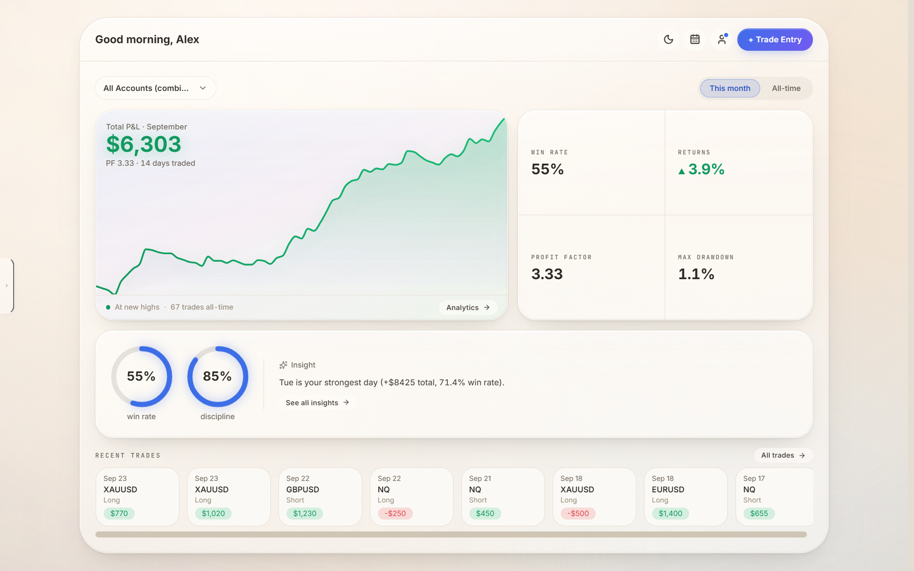

<div align="center">


# Trade Journal

**An offline-first desktop trading journal with the analytics prop-firm traders actually need:
drawdown forensics, payout eligibility, and edge by strategy, session and market context.**


[](https://github.com/mateitodirel/TradeJournal/releases/latest)



</div>

---

## Why another journal?

Most trading journals are either a spreadsheet or a subscription SaaS that uploads your whole
trading history to someone else's server. Trade Journal is neither:

- **Your data stays on your machine.** Everything lives in one local SQLite file. The app
  makes no network requests unless you switch on an optional feature.
- **Built for funded-account traders.** It knows how Apex and Lucid evaluations pay out,
  simulates whether your real trade history would pass, and tells you when you're
  payout-eligible.
- **Analytics that answer "why".** It doesn't stop at win rate: it breaks down drawdown
  episodes, runs the risk-adjusted ratios, and shows edge by confluence, session and
  market context.

## Features

### 📊 Analytics
- Equity curve, underwater curve, and a **drawdown episode history** (peak → trough → recovery)
- Risk-adjusted ratios: **Calmar, Ulcer, Martin, Pain, Burke, Sterling**
- **Edge by market context**: tag the conditions around each trade and see where your edge
  actually lives
- Performance radar, daily/weekly and monthly P&L, and a calendar heatmap
- Auto-generated insights, e.g. *"Tuesday is your strongest day (+$8,425, 71% win rate)"*

### 🏦 Prop-firm tools
- **Payout Calculator** with Apex and Lucid rule presets: qualifying days, consistency caps,
  safety net, and a payout log
- **Eval simulator** that block-bootstraps your real trading days to estimate your pass rate,
  **risk of ruin**, and payout-ready-on-pass odds
- **Prop Firm Fit**: run your own history against each firm's rules to see which one suits
  your style

### 🧭 Trading plan & playbooks
- Per-strategy **Kelly sizing, SQN, streaks**, and edge by confluence
- Playbooks for each setup, including their own drawdown profile
- Daily reviews: emotions, notes, and lessons learned

### 📝 Journaling
- Fast trade entry with sessions, direction, R-multiple, plan adherence, and positive and
  negative tags
- **Paste screenshots straight from the clipboard** (Ctrl+V) with a gallery view
- **Missed trades** logged separately, so the setups you hesitated on still teach you something
- A separate **Backtest** tab keeps backtested trades out of your live record
- CSV import and export (handles accounting-style negatives)

### 🔌 Optional, off by default
- **Economic calendar**: ForexFactory's weekly high-impact events, cached locally, with a
  live countdown on the dashboard and news matched to each trade's entry time
- **Shared journal**: an opt-in Supabase mirror so you and a trading partner see each other's
  trades, both on the Shared tab and merged read-only into your Trades table
- **Obsidian sync**: a one-way mirror of your journal into an Obsidian vault as Markdown

## Screenshots

| Analytics | Calendar |
|---|---|
|  |  |
| **Trades** | **Light theme** |
|  |  |

<sub>Screenshots use generated demo data.</sub>

## Download

Grab the latest build from **[Releases](https://github.com/mateitodirel/TradeJournal/releases/latest)**:

- `Trade.Journal.Setup.<version>.exe`: installer
- `Trade.Journal.<version>.exe`: portable, no install

Your journal is stored in `%APPDATA%\tradejournal\tradejournal.db`, and updating keeps your
data.

## Build from source

```bash
git clone https://github.com/mateitodirel/TradeJournal
cd TradeJournal
npm ci
npm run dev        # Vite + Electron with hot reload
npm run dist       # build the NSIS installer and the portable .exe into release/
```

Requires Node 22+ (the app uses the built-in `node:sqlite`).

For the optional Shared journal, copy `.env.example` to `.env`, fill in your Supabase URL and
anon key, and apply `supabase/schema.sql` to your project.

## Tech stack

| Layer | Choice |
|---|---|
| Shell | Electron 44 |
| UI | React 19, TypeScript, Vite, Motion |
| Charts | Recharts |
| Storage | SQLite via Node's built-in `node:sqlite`, no native modules |
| Sync (optional) | Supabase (auth, Postgres, Storage) |
| Packaging | electron-builder (NSIS + portable) |

## Contributors

Built by [@mateitodirel](https://github.com/mateitodirel) with
[@Nightdreams-bat](https://github.com/Nightdreams-bat).
